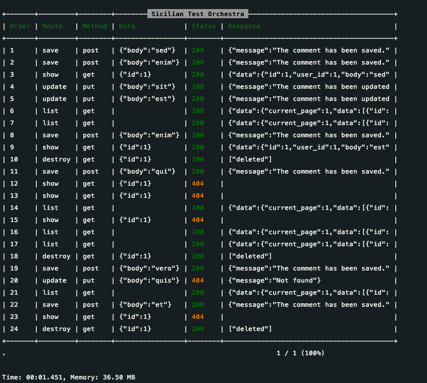

# Sicilian Test Orchestra


Sicilian Test Orchestra is an automated testing package designed for RESTful applications. It tests all routes with
generated faker data to ensure comprehensive coverage and robustness of your Laravel application.

[](https://github.com/mehdi-fathi/sicilian-test-orchestra/actions/workflows/laravel.yml)


A new way of testing to closely mimic user behavior. We never truncate the database after a test. These days, we have to
consider any scenario and provide mock data in the database for any scenario. At whole, sometimes we can't consider all
scenarios.

Even if we considered all scenarios, our code is changing every day. We have to update our testing, either updating
mocking data or factory data. I think, although we consider all user behavior and run all tests, we will encounter some
reportable and unpredictable bugs. In addition, in the old way, every test would run in an encapsulated space.

It means other tests never impact on other test's processes. While in the real world, each action has the potential to
impact other actions. For this purpose, we need to provide data requirements, in the old way.

The main difference is this package is not supposed to assert status or response. This package just sends requests and
shows the response and status with other information to you. When you have a 500 error in a specific scenario, you are
able to detect what's the problem. Sometimes you have leaking data in an endpoint in a specific scenario. So you can
check either response or status to make sure everything is ok.

## Main goals

### Reaching realistic tests

Users sending hundreds of requests would lead to some specific conditions which might be hidden completely. For
instance, a user should get a new badge when they visit 10 different posts with at least 5 likes on each of them. Okay,
you are able to make a test for this purpose in the old way, but what if the user was already limited? Did you consider
that? Okay, you can make a test for this as well, but what if the user dislikes a post? Should they still keep the
badge? You see, there would be a lot of complicated conditions that would lead to a 400 error or a wrong outcome. We aim
to provide a new way to test all facets comprehensively.

### Being aware of other actions impacts

Since you have been running all tests in an isolated method, what if an action would impact others badly? For instance,
a user makes a comment for the first time and then deletes it in a soft delete way. Then, the user clicks on the profile
menu where we're showing the number of comments, but we get a 500 error. So, are we able to consider this in testing?
Assuming we consider all possible scenarios in detail. What if we change something in the model? We need to update and
check all tests again. It's a time-consuming approach.

### Detailed Reporting

All scenarios have been saved in the database with requests, responses, etc. Furthermore, you're able to rerun specific
scenarios.

### Keeping data in the DB

We keep data in the database because we believe that it is useful for debugging or checking the way of saving or
updating.

## Features

- **Faker Data Integration**: Uses Faker to create realistic and varied test data.
- **Support for HTTP Methods**: Tests routes with different HTTP methods (GET, POST, PUT, DELETE, etc.).
- **Error Handling Tests**: Includes tests for error scenarios and edge cases.
- **Detailed Reporting**: Provides comprehensive reports and logs for easier debugging.
- **Performance Optimized**: Designed to minimize performance impact during testing.

## Requirements

- PHP 8.x or above
- Laravel >= 8.x

``
## Installation

1- Run the following command in your project directory to add the sicilian Test Orchestra as a dependency

        $ composer require mehdi-fathi/sicilian-test-orchestra

2- Add `SicilianTestOrchestra\SicilianTestOrchestraServiceProvider::class` to provider app.php

   ```php
   'providers' => [
     /*
      * Package Service Providers...
      */
      SicilianTestOrchestra\SicilianTestOrchestraServiceProvider::class
   ]
   ```

3- Run this command to create migration report_tests table.

    php artisan vendor:publish --tag=migrations

3- Use trait `RequestStrategyTestable` in feature test like this:

```php

namespace Tests\Feature;

use SicilianTestOrchestra\RequestStrategyTestable;
use Tests\TestCase;

class ExampleTest extends TestCase
{

    use RequestStrategyTestable;

    protected array $testOrchestraRequests = [
        'user_login' => ['auth'],  //auth,quest
        'shuffle_next' => true,
        'next' => [
            [
                'route' => 'save',
                'method' => 'post',
                'data' => [
                    // 'name' => ['string', 'min:1', 'max:4'],
                    'body' => ['string', 'min:1', 'max:4'],
                    // 'email' => ['email', 'min:1', 'max:40'],
                    // 'from_date' => ['date'], 
                    // 'age' => ['numeric', 'min:1', 'max:8'],
                    // 'has_job' => ['boolean'],
                    // 'favorite_colors' => ['array'],
                ],
                'call' => 1,
                'call_shuffle' => 5,
            ],
            [
                'route' => 'update',
                'method' => 'put',
                'data' => [
                    'body' => ['string', 'min:1', 'max:4'],
                ],
                'param' => [
                    'id' => ['numeric', 'min:1', 'max:1']
                ],
                'call' => 1,
                'call_shuffle' => 2,
            ],
            [
                'route' => 'list',
                'method' => 'get',
                'data' => [],
                'call' => 1,
                'call_shuffle' => 2,
            ],
            [
                'route' => 'list',
                'method' => 'get',
                'data' => [],
                'call' => 1,
                'call_shuffle' => 2,
            ],
            [
                'route' => 'show',
                'method' => 'get',
                'data' => [
                    'id' => ['numeric', 'min:1', 'max:1']
                ],
                'call' => 1,
                'call_shuffle' => 2,
            ],
            [
                'route' => 'destroy',
                'method' => 'get',
                'data' => [
                    'id' => ['numeric', 'min:1', 'max:1']
                ],
                'call' => 1,
                'call_shuffle' => 2,
            ],
            [
                'route' => 'show',
                'method' => 'get',
                'data' => [
                    'id' => ['numeric', 'min:1', 'max:1']
                ],
                'call' => 1,
                'call_shuffle' => 2,

            ],
        ]
    ];
    


```

4- Run test:

```
php artisan test
    
```



## About Sicilian Test Orchestra in detail

Since this package is really young, I want to foster that gradually. As I mentioned, this package would be used to test Laravel
Applications, potentially. This project is released recently in the 1.0 version. What would encourage me to develop is
to read your ideas and viewpoints. So Not only I would like to know your thoughts about that gap in the feature test But
also your view about the Sicilian Test Orchestra would be helpful. This package has a long way to go, obviously. I would
like you to hear your idea freely so make an issue in my GitHub.

## Contributing

We welcome contributions to the Sicilian Test Orchestra package. Please read our [CONTRIBUTING.md](CONTRIBUTING.md) for details
on our code of conduct and the process for submitting pull requests.

## License

This project is licensed under the MIT License - see the [LICENSE.md](LICENSE.md) file for details.

